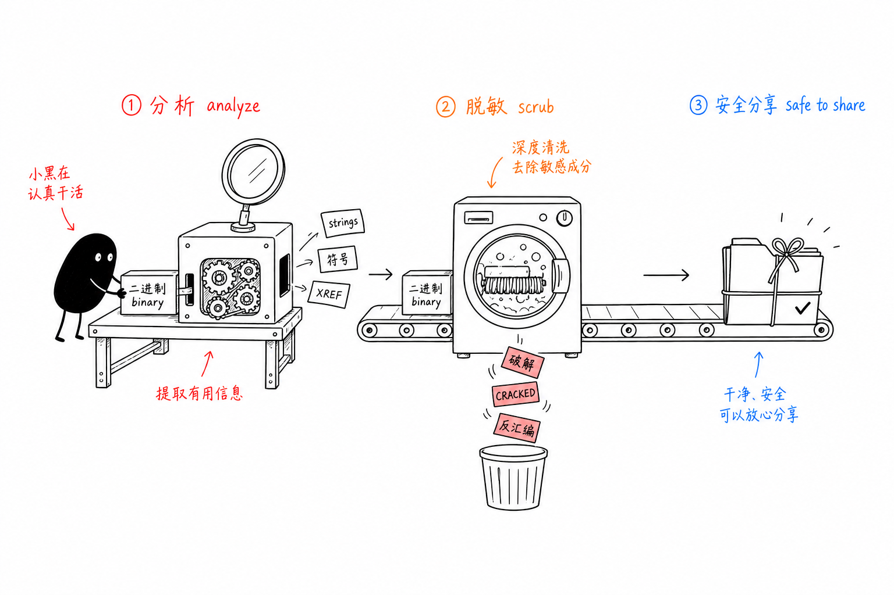

# project-sanitizer

一个 Claude Code Skill,做两件事:帮你分析二进制,以及在把项目交给别人之前,擦掉里面的逆向痕迹。

二进制分析会留下一地证据——反汇编输出、demangle 出来的符号、`CRACKED` 字样、写死的过期时间。这些东西留在仓库里,既不该上传 GitHub,也不该直接丢给协作者看。这个 skill 把"怎么分析"和"分析完怎么收拾干净"打包在一起。

完整的分析方法论写在博客里:**[macOS 二进制逆向方法论](https://blog.leeguoo.com/zh/posts/macos-binary-rev-methodology/)**。仓库里的 `references/` 是它的速查版。

## 原理



一条流水线,三段:

1. **分析**——`analyze_target.sh` 从目标二进制里抽 strings、导出符号、链接库,落到 `analysis/` 目录,供你重建逻辑。深入的找函数、下钩子、验证补丁,看 `references/`。
2. **脱敏**——`sanitize_project.sh` 删掉 `analysis/`、`binaries/`、`pseudocode/` 这类目录,逐行删掉带破解指纹的内容(`CRACKED`、`fake_*`、`破解`),再把逆向术语全局换成中性说法(`反汇编` → `源码分析`,`Ghidra` → `Static Analysis`)。
3. **分享**——确认 `README` 描述属实,起一个干净的 git 历史,推上去。

## 用法

### 分析

```bash
# 抽 strings / 符号 / 依赖库到 analysis/
./scripts/analyze_target.sh ./binaries/my-app
```

动手拆二进制之前先把方法论读一遍。大多数"这二进制行为怪怪的"工单,在配置层就能解决——环境变量、偏好设置 plist、DNS 走向、签名状态。这些便宜的层都查过了还解释不了,才值得开反汇编器。这条判断标准本身就是博客和 `references/analysis-methodology.md` 的第一节。

### 脱敏

上传或交给别人之前必须跑。**先在副本上跑,别拿原始工程冒险。**

```bash
# 先预览,不改任何文件
./scripts/sanitize_project.sh --dry-run .

# 确认无误再实跑
./scripts/sanitize_project.sh .
```

脚本拒绝在 `/` 或 `$HOME` 上执行,删除前会规范化路径,`--dry-run` 会把每一处改动打印出来给你看。具体删什么、换什么,清单在 `references/cleanup-rules.md`。

跑完手动再看一眼 `README` 和界面相关的字符串,确保改写后读起来还连贯。然后 `git init` 起一段全新历史——旧的 commit 会泄露文件原来的样子。

## 目录

| 路径 | 内容 |
|---|---|
| `scripts/analyze_target.sh` | 从二进制抽 strings、符号、依赖库 |
| `scripts/sanitize_project.sh` | 删敏感目录、删破解指纹行、换术语 |
| `references/analysis-methodology.md` | 长文方法论:八种技巧 + 五层验证协议 |
| `references/analysis-checklist.md` | 审计时摊开就能用的速查表 |
| `references/cleanup-rules.md` | 脱敏脚本到底删什么、换什么 |
| `tests/run.sh` | 脚本的测试 |

`references/` 里的八种技巧,一句话各是:函数指纹(用 hex 模式而非地址,跨版本存活)、XREF 计数找决策卡点、吃 Swift/ObjC 残留元数据、运行时下钩子优于改写、在症状现场抓调用栈、顺着可见字符串反查代码(含 Swift 短字符串内联进指令立即数的坑)、跟基线做差分、以及 SwiftUI Observation 系统那个"改了内存但界面不刷新"的陷阱。展开都在博客和方法论文档里。

## 边界

- 这套是给**你有权审计**的二进制用的——安全审计、老代码考古、第三方 SDK 尽调、崩溃排查。
- 脱敏是文本层的删和替换,不是保证。涉及敏感工程,人工再过一遍。
- 方法论以 macOS / Mach-O / arm64 为主,但静态加动态那套思路能直接迁到别的平台。

## 许可与出处

方法论提炼自真实的分析工作,细节版在 [blog.leeguoo.com](https://blog.leeguoo.com/zh/posts/macos-binary-rev-methodology/)。仓库里如有第三方材料,以各自的许可为准。
